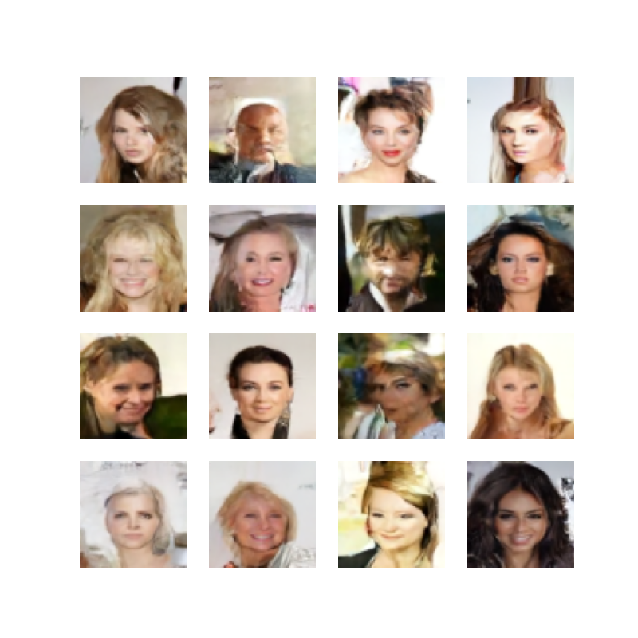

# GEN-AI-Toolbox: A Training Lab for Neural Network Image Synthesis


Randomly selected images created by training a DDPM model on the CelebA dataset.

## Start Training

To train a DDPM model on the CelebA dataset, execute

```
python run_as_configured.py -cn celebrity-diffusion debug=False
```

To train a WGAN-GP model on the CelebA dataset, execute

```
python run_as_configured.py -cn celebrity-gan debug=False
```

